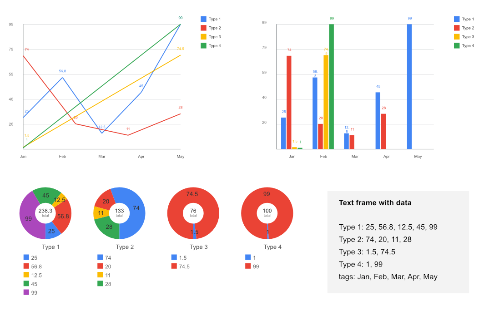

# Affinity Chart Builder

Script for Affinity that builds line, bar, and donut charts from numeric data in a text frame.



## Features

- **Line Chart** — multi-series lines with round caps, grid, 1pt axes, 0.5pt grid lines
- **Bar Chart** — grouped bars with sharp corners, unique colors per series
- **Donut Chart** — pie slices with inner radius, optional % labels, per-diagram legends
- **32-color palette** — unique colors for all data series
- **Configurable** — width, height, line thickness, legend, show % for donut

## Data Format

Create a text frame with data in this format:

```
Type 1: 25, 56.8, 12.5, 45, 99
Type 2: 74, 20, 11, 28
Type 3: 1.5, 74.5
Type 4: 1, 99
tags: Jan, Feb, Mar, Apr, May
```

- Each `name: values` line defines a data series with a name
- `tags:` line defines X-axis labels (optional)
- Multiple series supported, different lengths per series allowed

## Usage

1. Create a text frame with your data
2. Select the text frame
3. Run the script via Affinity Script Manager
4. Choose chart type and parameters in the dialog
5. Click OK to generate the chart

## Parameters

- **Type** — Line, Bar, or Donut
- **W / H** — chart dimensions in pixels (default: 500x400)
- **Thick** — line thickness in pixels (default: 2)
- **Legend** — show/hide legend
- **Show %** — show percentages in donut chart labels

## Version

1.1.1
