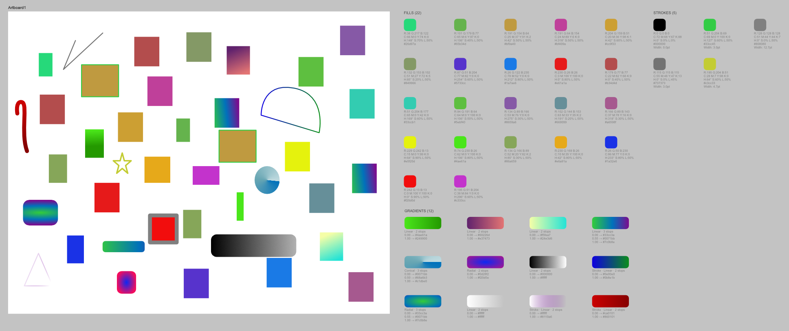
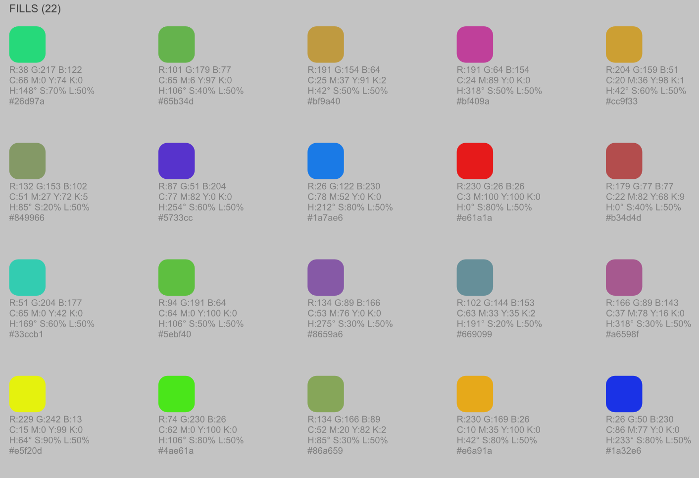
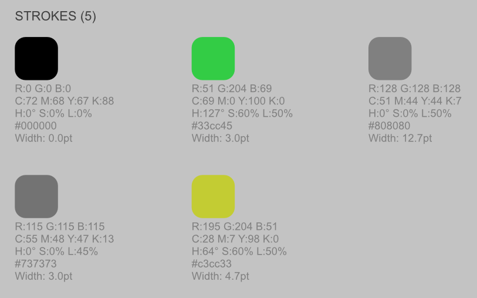
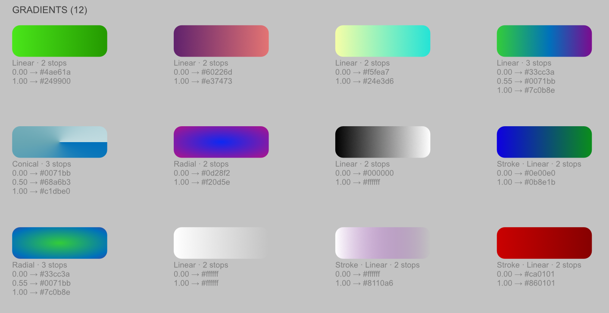

# Color Palette Generator для Affinity

Скрипт для Affinity Designer/Photo/Publisher, который автоматически извлекает все цвета из документа и создаёт организованную палитру с подробной информацией.

## Что делает

Скрипт анализирует текущую страницу/артборд и собирает **все уникальные цвета** из заливок, обводок и градиентов. Результат — готовая палитра, размещённая справа от макета.

### Заливки

Для каждого уникального цвета выводится:
- Цветной образец
- **RGB** — R, G, B значения
- **CMYK** — профиль-зависимое преобразование (точно как в палитре Affinity)
- **HSL** — тон, насыщенность, яркость
- **HEX** — шестнадцатеричный код

### Обводки

Аналогично заливкам, но с дополнительным показателем — **толщиной линии** в pt.

### Градиенты

Для каждого градиента:
- Тип (Linear, Elliptical, Radial, Conical)
- Количество стопов
- Позиция и цвет каждого стопа
- Поддержка как заливок, так и обводок

## Установка

1. Скачайте `color-palette-gen.js` из [репозитория](https://github.com/nodeus/affinity-color-palette-gen)
2. В Affinity: **Tools → Scripts → Script Manager** → добавьте скрипт

## Использование

1. Откройте документ с объектами
2. Запустите скрипт через **Script Manager** или горячую клавишу
3. Палитра появится справа от содержимого страницы, сгруппированная по секциям: Fills, Strokes, Gradients

> Скрипт анализирует только текущую активную страницу/артборд.

## GitHub

https://github.com/nodeus/affinity-color-palette-gen
